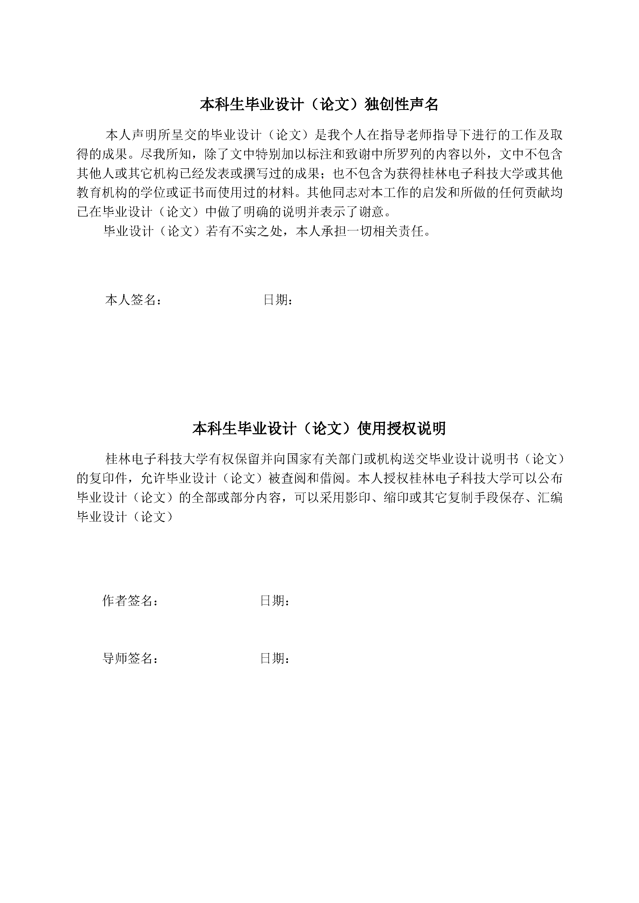
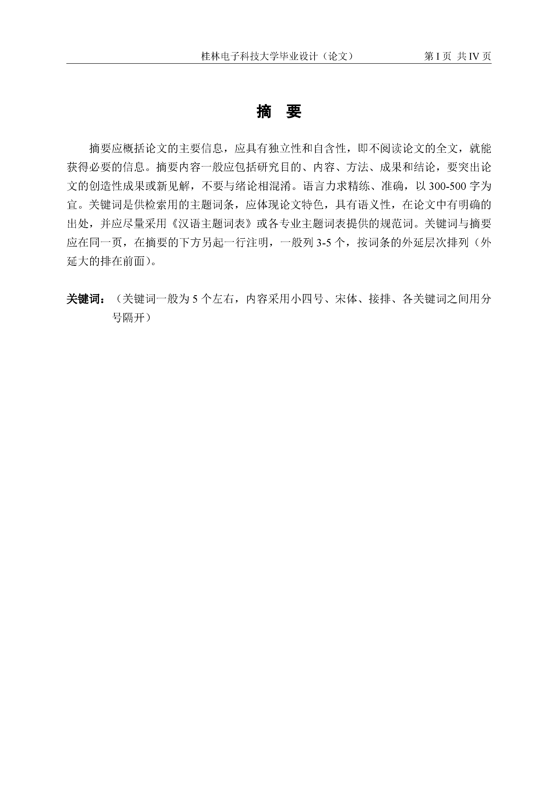
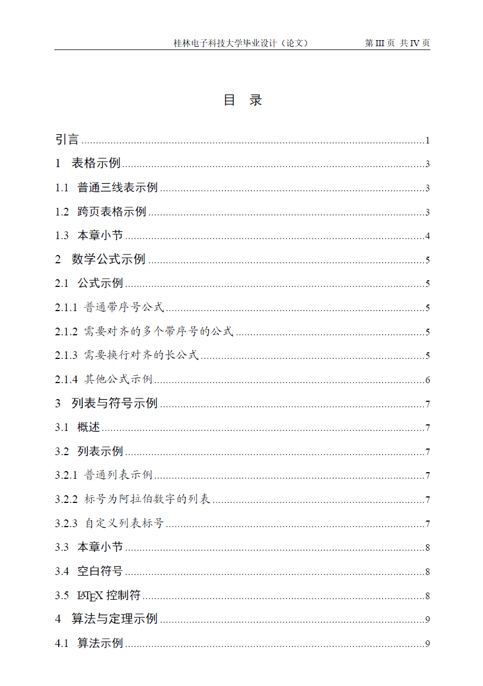
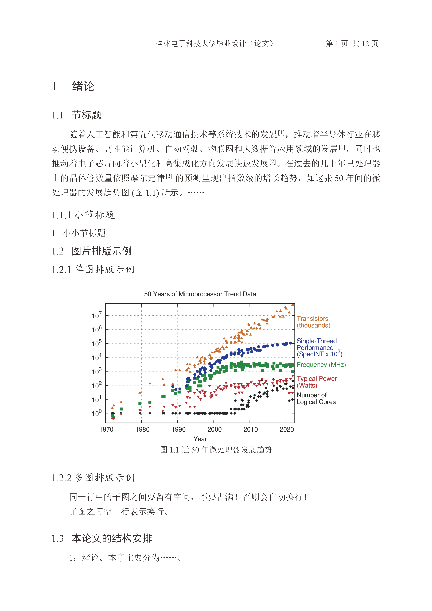
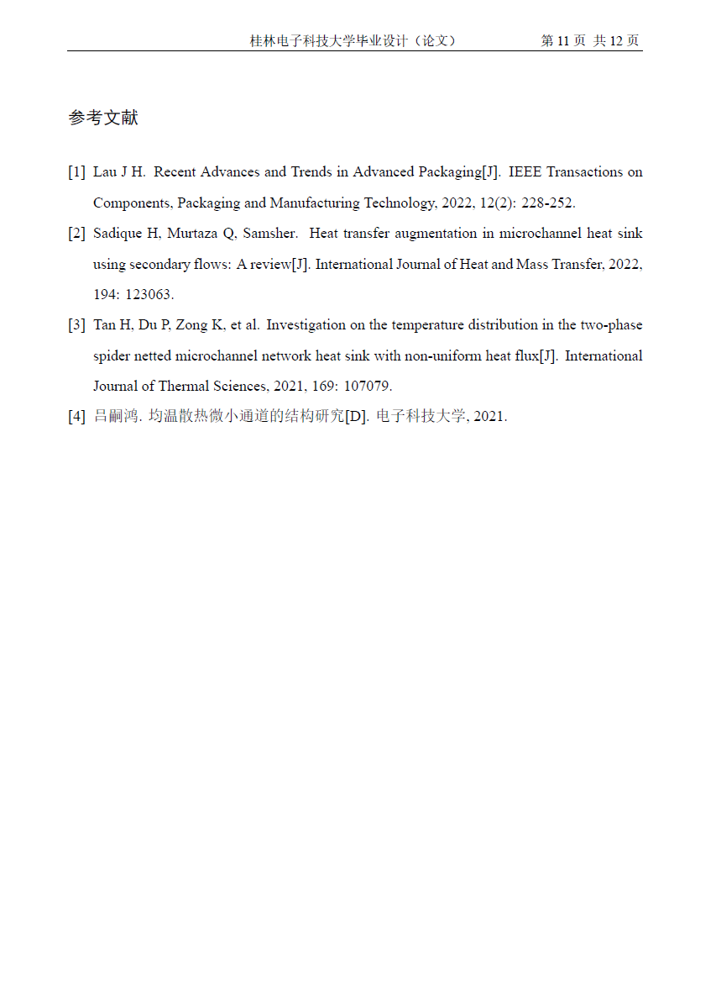

## 桂林电子科技大学本科毕业论文LaTex模板 

此项目提供用于排版桂林电子科技大学本科毕业论文的 LaTeX 模板，旨在帮助桂林电子科技大学同学高效地完成毕业论文的写作(注重内容、忽略排版)。本模板由项目[Guet_LATEX_Thesis_Template](https://github.com/YanMing-lxb/Guet_LATEX_Thesis_Template)精简过来，原本本科、研究生都可以切换，但考虑到样式冗杂，现单独精简本科毕业论文模板。桂林电子科技大学校徽图片的版权归桂林电子科技大学所有，README与论文的校徽仅仅作为标识，如有侵权请联系[邮箱](mailto:wrm244@qq.com)，将会删除。

## 模板示例
<p align=center>

</p>

## 获取模板

### Overleaf
可以直接使用我们已经上传好的Overleaf在线模板：

[](https://www.overleaf.com/latex/templates/gui-lin-dian-zi-ke-ji-da-xue-ben-ke-bi-ye-lun-wen-latexmo-ban/nbynzyvwvndg)

### 下载模板本地编译

```
git clone https://github.com/wrm244/GUEThsis.git
```

## 使用方法

### 本地部署写作

#### 基本环境

使用模板需要系统安装任意一种 TeX 环境，如[TeXLive](http://mirror.ctan.org/systems/texlive/Images/)、[MacTeX](https://www.tug.org/mactex/mactex-download.html)和[MiKTeX](https://miktex.org/download)（都自动带有 XeLaTeX 引擎，但是不推荐 CTeX），安装有 SimSun 和 SimHei 字体（其实就是宋体和黑体）以及 Times New Roman 英文字体。在 MacOS 系统下编译会自动识别操作系统，使用 Songti SC 和 STHeiti 字体，但需要启用`--shell-escape`编译选项。

#### latexmk 编译

编译文档请使用 XeLaTeX 引擎。模版提供 latexmk 设置文件用于自动编译。latexmk 可自动调用相关程序进行编译，处理各种文件依赖并自动预览。可在终端执行`latexmk -c`命令清理所有缓存文件。

使用 latexmk 编译前，需在系统盘下创建名为 latexmk 的文件夹，并将 LatexMK 文件放入该文件夹下。请勿删掉 latexmkrc 文件。

**<font color="#d83931">注意</font>**：如果在 Windows 平台下使用 MiKTeX 还需要安装[Perl 语言解释器](http://strawberryperl.com/)，方可使用 latexmk 进行编译。

编译时只需使用 latexmk 即可完成编译。
#### 编辑器

推荐使用 Visual Code Studio 编辑器。

1. Visual Code Studio 中安装 LaTeX Workshop 插件；
2. 所需的配置设置请看：[Visual*Code_Studio*中 LaTeX_Workshop 的设置说明](./docs/Visual_Code_Studio_%E4%B8%ADLaTeX_Workshop%E7%9A%84%E8%AE%BE%E7%BD%AE%E8%AF%B4%E6%98%8E.md)

#### 转 word 格式

请看：[转 word 命令](./docs/%E8%BD%ACword%E5%91%BD%E4%BB%A4.md)

**注意：**

- 使用 LaTeX 转 Word 是通过 Pandoc 来实现，因此需要配置好 Pandoc；
- 目前尚且存在转换后，图片不存在的问题（由于 pandoc 不支持读取多个文件夹图片的原因）。

### Github Action 自动化集成

在仓库中提供CI/CD执行编译渲染PDF流程，你只要FORK这个仓库，然后本地编写或者直接通过github网页直接编写后push到你的github仓库，即可自动渲染,以下是ACTION配置代码：
```yml
name: Build LaTeX document
on:
    push:
      branches: [ main ]
jobs:
  build_latex:
    runs-on: ubuntu-latest
    steps:
      - name: Set up Git repository
        uses: actions/checkout@v3
      - name: Compile LaTeX document
        uses: xu-cheng/latex-action@v2
        with:
          root_file: main.tex
          latexmk_use_xelatex: true
      - name: Upload PDF file
        uses: actions/upload-artifact@v3
        with:
          name: PDF
          path: main.pdf
          
```
下载渲染后的PDF是在这个位置：


## 模板说明

### 样式参数

|   命令    |   功能   |
| :-------: | :------: |
| eversion  |  电子版  |
| pversion  |  打印版  |

### 注意事项

- 在具有多个子图的情况时，子图与子图之间要留有一定的空间，不要占满，否则会发生自动换行；
- 标题中`\texorpdfstring` 命令包装数学公式，并提供一个无公式的备选项，如：`\section{\texorpdfstring{$E=mc^2$}{E=mc2}} ` 否则会有警告。

### 论文封面

论文封面和扉页由`\makecover`命令添加，可以显示论文题目，作者，指导老师等，也可使用`\bindpdfcover{cover.pdf}`命令添加封面.独创性声明可以由`\originalitydeclaration`命令生成，添加扫描版签名后的声明使用`\signatureofdeclaration{signature.pdf}`命令。

封面显示的信息可以使用一系列命令进行设置，包括标题、作者、学院等：

| 命令名称              | 参数#1       | 参数#2   |
| --------------------- | ------------ | -------- |
| \title{#1}{#2}        | 中文标题     | 英语标题 |
| \author{#1}           | 作者名       | 无       |
| \advisor{#1}          | 导师名       | 无       |
| \protitle{#1}         | 导师职称     | 无       |
| \school{#1}           | 学院名       | 无       |
| \major{#1}            | 专业名       | 无       |
| \studentnumber{#1}    | 学号         | 无       |
| \degreecategories{#1} | 申请学位门类 | 无       |
| \datereply{#1}        | 论文答辩日期 | 无       |

如果想使用自己定义的封面，可以用`\bindpdfcover`命令添加已经做好的 PDF 格式的封面，如`\bindpdfcover{cover.pdf}`。

### 中英文摘要

中英文摘要应包含在`chineseabstract`和`englishabstract`环境中，对应的关键字使用`\chinesekeyword`和`\englishkeyword`命令添加，并包含在相应的环境中。

## 写作工具

- 画表神器 https://www.tablesgenerator.com/
- 写公式神器 https://mathpix.com/
- 文献 bib 整理神器 https://dblp.uni-trier.de/
- Latex 画图画表常用命令 https://en.wikibooks.org/wiki/LaTeX/Floats,_Figures_and_Captions#Tip

## 软件许可证
桂林电子科技大学校徽图片的版权归桂林电子科技大学所有，README与论文的校徽仅仅作为标识，如有侵权请联系[邮箱](mailto:wrm244@qq.com)，将会删除。

其他部分使用 [LPPL](https://www.latex-project.org/lppl/) 授权。
